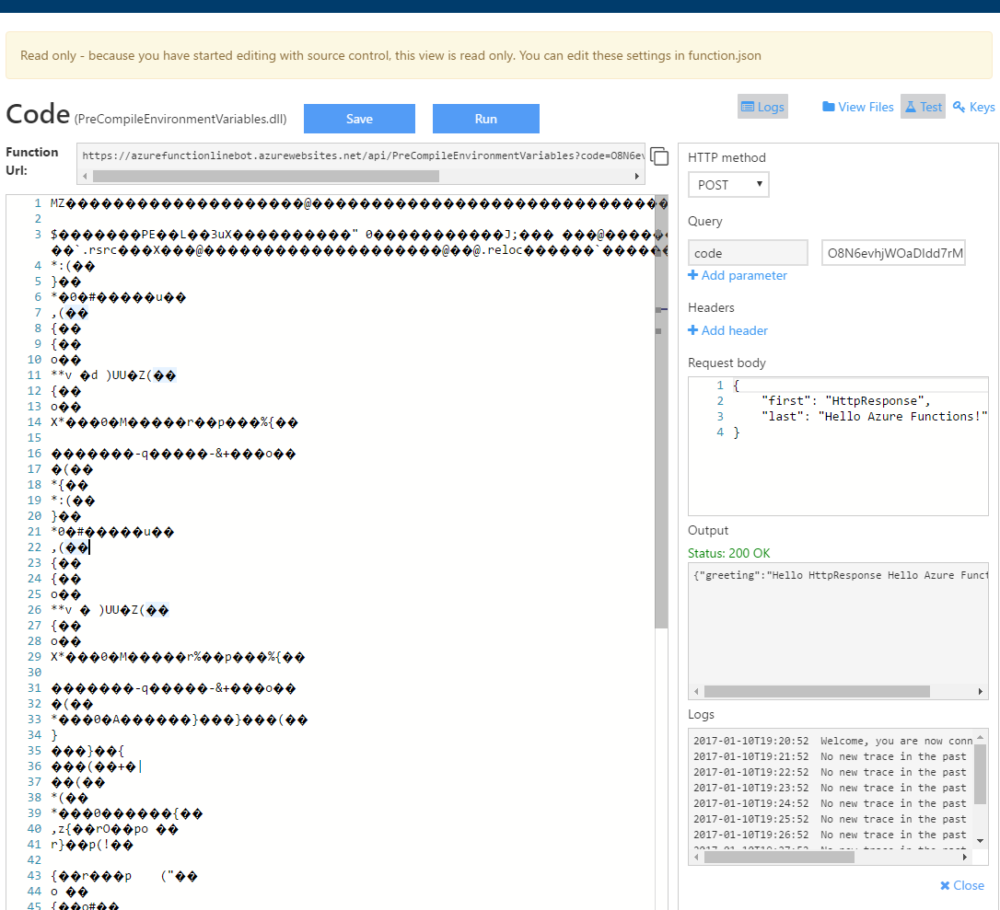
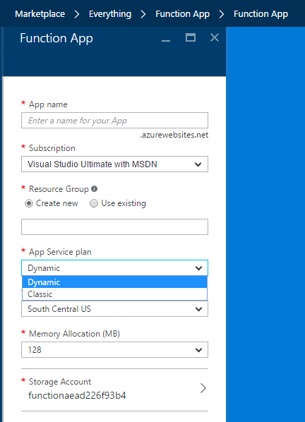
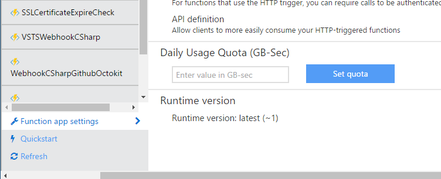
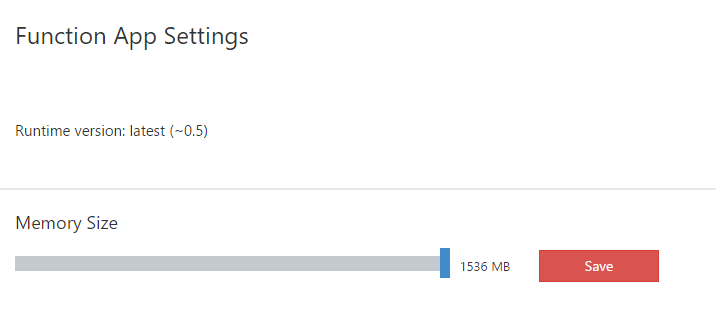
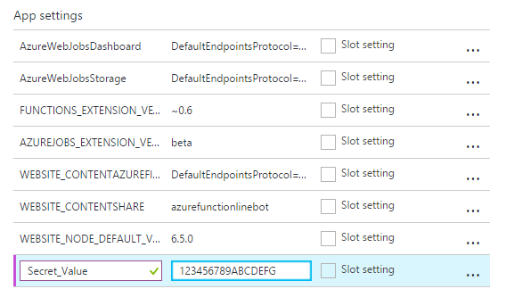

# AzureFunctionsIntroduction

This is Sample project for Azure Functions. May this repository help you understand Azure Functions better.

# What you can know

This sample include following.

FunctionName | Language | Pre-compiled? | Description
---- | ---- | ----  | ----
AppSettingsWebhookCSharp | C# | No | Reference ```Application Settings > App Setting``` of Web Apps Sample code.
CSharpCompilerSlackOuthookCSharp | C# | No | Slack Interactive C# Code Roslyn Evaluation Sample. (```@C#: Enumerable.Range(10, 20).Aggregate((x, y) => x + y)```)
CSharpCompilerWebhookCSharp | C# | No | Generic Webhook C# Code Roslyn Evaluation Sample.
DotNetFrameworkVersionResponseCSharp | C# | No | Retrurn .NET Framework Friendly Name by passing .NET Framework Release Registry Value.
ExternalCsxWebhookCSharp | C# | No | Reference external .csx usage Sample code.
GenericWebhookCSharpExtensionMethod | C# | No | Extension Method usage Sample code.
GithubWebhookCSharp | C# | No | Github Webhook Sample code.
LineBotWebhookCSharp | C# | No | Line Bot Webhook Sample code with Emergency Evacuation info with sent info.
SSLCertificateExpireCheck | C# | No | SSL Certificate Checker. Often introduce in AWS Lambda but you can do with C# + AzureFucntions, too! 
VSTSWebhookCSharp | C# | No | Visual Studio Team Service (VSTS) Webhook Sample code.
WebhookCSharpGithubOctokit | C# | No | NuGet package reference sample for Octokit.
WebhookCSharpSendToChatWork | C# | No | Chatwork Notification Sample code.
WebhookCSharpSendToSlack | C# | No | Slack Notification Sample code.
src/PreCompiledFunctionSample | C# | Yes | Basic sample of PreCompiled Function. Build artifact will published right under root as PreCompiledFunctionSample.
src/PreCompileEnvironmentVariables | C# | Yes | Basic sample of PreCompiled Function with Logger. Build artifact will published right under root as PreCompileEnvironmentVariables.

# GitHub Integration Sample

You may find this repository structure is fit with Azure Functions CI by Github.

This repogitory Sync with Azure Functions by GitHub Integration.

# More Reference

http://tech.guitarrapc.com/archive/category/AzureFunctions

# Precompiled functions reference

Refer basic information with https://github.com/Azure/azure-webjobs-sdk-script/wiki/Precompiled-functions .

Following additional tips will be useful for first step.

Description | Screenshot
---- | ----
Precomplied function's Run signature will accept TraceWriter. Use Logger as same as .csx even you are using Precompile. You need to add [Microsoft.Azure.WebJobs.Host](https://www.nuget.org/packages/Microsoft.Azure.WebJobs) nuget package to refer TraceWriter. | 
Precompiled function required to add [Microsoft.AspNet.WebApi.Core](https://www.nuget.org/packages/microsoft.aspnet.webapi.core/) nuget package for several HttpRequestMessage Extensions. | 
Precompiled function's dll will be locked by w3wp.exe when deployed function. You should kill w3wp.exe and restart AppService to deploy new PreCompiled dll. | <br/><br/> 

# Recommend Azure Functions settings for stability

These settings are my recommendation with using AzureFunctions.

Description | Screenshot
---- | ----
[Concider to select Dynamic Service Plan if possible.]((https://azure.microsoft.com/en-us/documentation/articles/functions-scale/)) <br/>This will bring you best cost efficiency and scalability | 
Keep your Azure Functions Runtime version up-to-date. Actually there's no meaning concider downtime because apply will be done in just a seconds. [Azure Functions host (0.x) are deprecated and will be remove starting February 1st, 2017. if you're using preview features, you continue to set your minor version explicitly (i.e. ~1.0), rather than just the major version(~1).](https://blogs.msdn.microsoft.com/appserviceteam/2017/01/03/azure-functions-preview-versioning-update/). <br/><br/>[You can find Release note here.](https://github.com/Azure/azure-webjobs-sdk-script/releases) | <br/>
[Keep Function App Platform 32bit (don't change to 64bit)](http://stackoverflow.com/questions/36653122/is-there-any-difference-between-platform-32-bit-or-platform-64-bit-for-azure) | 
Do not run out memory, add Dynamic Memory if needed! Default 128MB will be run out easiry. Upgrade to 256MB or higher as your app requires.<br/> Dynamic Plan pricing is relates to Memory size, but less meanful to concider.<br/>[AzureFunctions pricing is here.](https://azure.microsoft.com/en-us/pricing/details/functions/)  | 
Make sure your functions in AppService will be less than 1536MB. [This is limiation of Dynamic Service Plan](https://azure.microsoft.com/en-us/documentation/articles/functions-scale/). <br/>In case you exceed 1536MB there's 2 options.<br/> - Divide to separate functions. <br/>- Combine all functions to single App Service Plan. | 
Stop nesting multiple Azure Functions, use ```#load "<YourCoolLogic.csx>"``` to load shared code. <br/> This is efficient and speedier way to call functions.  | 
Use AppSettings to store secret values. This eliminate sensitive value in the source code.<br/>You can load it with both ```System.Environment.GetEnvironmentVariable("Key")``` or ```System.Configuration.ConfigurationManager.AppSettings["Key"]```. <br/> C# sample with screenShot: ```GetEnvironmentVariable("Secret_Value")``` or ```ConfigurationManager.AppSettings["Secret_Value"];```<br/>[See C# Dev Samples for more details](https://azure.microsoft.com/en-us/documentation/articles/functions-reference-csharp/) |  

# Not Recommend

There's are possible but I never recommend. These settings will bring complexity 

Description | Screenshot
---- | ----
Default TimeZone is UTC, but you can use LocalTime zone with ```WEBSITE_TIME_ZONE``` into Application Settings.<br/>You can obtain all timezone string with ```System.TimeZoneInfo.GetSystemTimeZones()``` <br/>Detail is here : [Changing the server time zone on Azure Web Apps](https://blogs.msdn.microsoft.com/tomholl/2015/04/06/changing-the-server-time-zone-on-azure-web-apps/)  | 

# License

[MIT](https://github.com/guitarrapc/AzureFunctionsIntroduction/blob/master/LICENSE)
